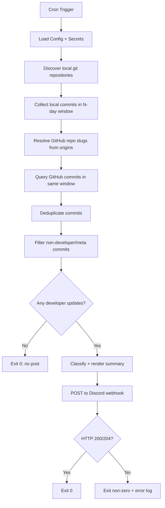

# Discord Status Integration — Process Flow

## Runtime flow

1. Cron triggers the marketing Discord status script.
2. Script resolves configuration (days, max items, repo root, webhook source, GitHub auth source).
3. Script discovers local git repositories under the configured root.
4. Script reads local commit history within lookback window.
5. Script resolves GitHub repository slugs from local origins.
6. Script queries GitHub commit APIs for the same lookback window.
7. Script filters out non-developer/meta commits (status bookkeeping, session/outbox noise).
8. If no developer updates remain, script exits `0` without generating or posting an update.
9. Script classifies remaining commits into feature enhancements vs improvements/fixes.
10. Script composes a bounded Discord message payload.
11. Script posts payload to Discord webhook.
12. Script exits with:
   - `0` on success
   - non-zero on configuration/query/delivery error

## Mermaid flow

## Operational behavior

- **Manual run path:** supports `--dry-run` to preview output without posting.
- **No-update window handling:**
  - default: publish explicit no-update status message
  - optional: `--skip-empty` suppresses no-update posts
- **Failure behavior:** no silent fallback; failures surface to cron logs and exit non-zero.

## Inputs and outputs

### Inputs
- Local repository root (`/home/ubuntu/forseti.life` by default)
- Local git commit history (lookback window)
- GitHub commit API responses (lookback window)
- Discord webhook config
- GitHub auth config

### Outputs
- Discord post content
- Cron log line with success/failure summary
